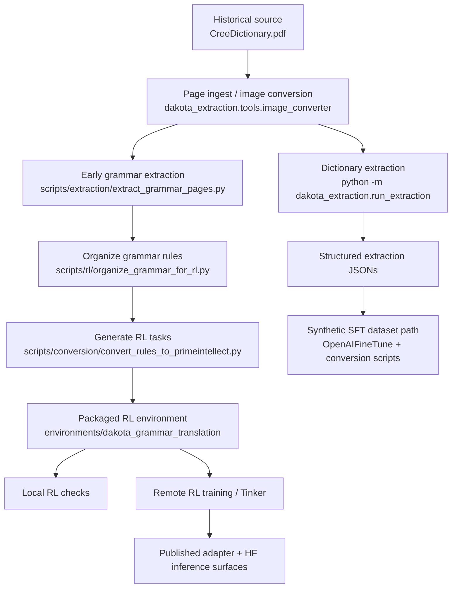

# Cree1865 Pipeline Template

This repository starts from the same core chain used in `Dakota1890`, but applies it to a different historical origin document.

## Template Path

## Important Constraint

The code surface is still Dakota-derived:

- package names still use `dakota_*`
- the packaged environment is still `dakota_grammar_translation`
- several scripts still encode Dakota assumptions in prompts and schemas

That is acceptable at bootstrap time. The rule for this repo is:

- preserve the known-good pipeline shape
- generalize only where the Cree source actually requires it

## Cree-Specific Starting Assumptions

- pages `1-24` are likely preface/basic grammar
- pages after `24` are likely dictionary-focused
- a second volume is missing and may affect schema design

## First Adaptation Targets

1. page-boundary verification
2. Cree dictionary entry schema
3. orthography and prompt updates
4. grammar extraction schema for the shorter front matter
5. publication path reuse for the eventual Cree model
