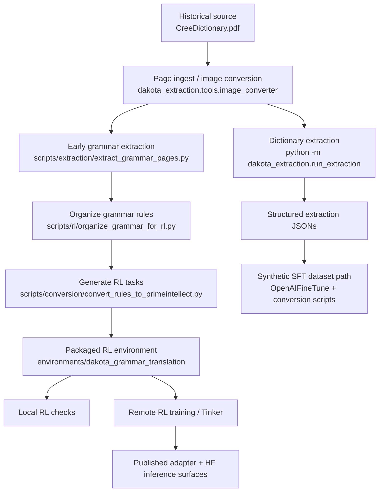

# Cree1865 Pipeline Template

This repository starts from the same core chain used in `Dakota1890`, but applies it to a different historical origin document.

## Template Path

## Important Constraint

The code surface is still Dakota-derived:

- package names still use `dakota_*`
- the packaged environment is still `dakota_grammar_translation`
- several scripts still encode Dakota assumptions in prompts and schemas

That is acceptable at bootstrap time. The rule for this repo is:

- preserve the known-good pipeline shape
- generalize only where the Cree source actually requires it

## Cree-Specific Starting Assumptions

- pages `1-28` contain front matter, pronunciation guidance, and early grammar notes
- page `29` is the first confirmed dictionary page
- the structured extraction path now has prompts for both `Part I. English -> Cree` and `Part II. Cree -> English`
- the reverse `Part II. Cree -> English` transition lands around printed page `183`, which corresponds to PDF pages `211-212` in the local scan
- `Part II` reverse extraction normalizes Cree headwords into `cree_primary` and English glosses into `english_headword`

## First Adaptation Targets

1. run and monitor the 1200-step small-model Tinker pass
2. inspect reward ledgers for exact-match, character-overlap, and pattern channels
3. promote the Q&A export to a shareable dataset once community-review language is settled
4. keep grammar extraction separate until the front-matter rule surface is stable
5. publish the selected Cree checkpoint/model card after a non-smoke run

## Current Validation Surface

- Offline bootstrap validation: `python scripts/cree/validate_cree_bootstrap.py`
- Live dictionary extraction runner: `python scripts/cree/run_cree_pipeline.py --dictionary-pages 29 40 100 --reverse-pages 212 220`
- Full local dataset build: `data/cree_goal_run_20260624_full_dictionary/training_datasets`
