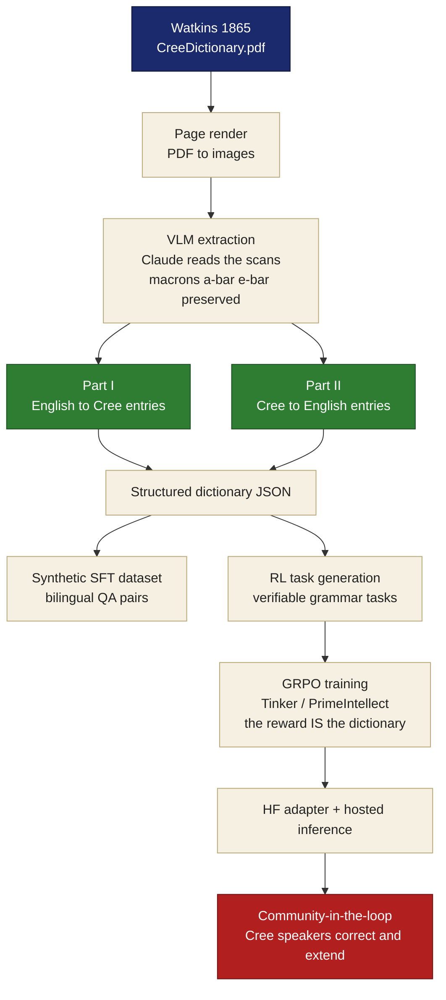

<!-- ╔══════════════════════════════════════════════════════════════════════════╗
     ║  CREE1865 · SHOWCASE README                                                ║
     ║  Showcase README for the Cree1865 model/repo. Grounded only in the         ║
     ║  Watkins 1865 dictionary source and the actual extraction/training run.    ║
     ╚══════════════════════════════════════════════════════════════════════════╝ -->

<!-- ───────────────────────────  HERO  ─────────────────────────── -->
<div align="center">


<!-- animated tagline -->
<a href="#the-thesis">
  
</a>

<br><br>

<!-- ─────────────  BADGE WALL  ───────────── -->
<a href="LICENSE"></a>
<a href="DATA_LICENSE.md"></a>

<br>


<br><br>

<!-- ─────────────  NAV  ───────────── -->
<b>
<a href="#the-thesis">Thesis</a> &nbsp;·&nbsp;
<a href="#the-source--watkins-1865">The Source</a> &nbsp;·&nbsp;
<a href="#the-pipeline--single-source--reward-loop">Pipeline</a> &nbsp;·&nbsp;
<a href="#extraction-at-a-glance">Extraction</a> &nbsp;·&nbsp;
<a href="#the-reward-function">Reward</a> &nbsp;·&nbsp;
<a href="#the-model-run">Models</a> &nbsp;·&nbsp;
<a href="#roadmap">Roadmap</a> &nbsp;·&nbsp;
<a href="#acknowledgments">Credits</a>
</b>

</div>

---

<!-- ───────────────────────────  THESIS  ─────────────────────────── -->
## The Thesis

> **A working Cree model from one historical source — turning a single 1865 dictionary into supervised data, verifiable RL tasks, and a GRPO training loop.**

To our knowledge this is the first time the *grammar-as-reward* method — proven on the 1890 Dakota grammar in [**Dakota1890**](https://github.com/HarleyCoops/Dakota1890) — has been retargeted to **Cree** from a single public-domain source: **Rev. E. A. Watkins' 1865 _A Dictionary of the Cree Language_**.

The core result is the pipeline: a single source is enough to produce aligned training examples and a deterministic reward surface. That directly attacks the parallel-corpus bottleneck for low-resource language modeling.

The whole chain runs from one source:

<div align="center">

`Watkins 1865` → `VLM extraction` → `structured schema` → `SFT data` → `verifiable RL tasks` → `GRPO training` → `working model`

</div>

---

<!-- ───────────────────────────  SOURCE  ─────────────────────────── -->
## The Source — Watkins 1865

Watkins 1865 is **not a vocabulary dump**. It is a bilingual dictionary printed under missionary conditions across the Hudson's Bay territories. The model and datasets here are built from this one source volume:

| Part | Direction | Printed pages | Local PDF pages | Schema state |
|------|-----------|:-------------:|:---------------:|--------------|
| **Front matter** | pronunciation key + early grammar notes | i – xx | 1 – 28 | reference only |
| **Part I** | **English → Cree** | 1 – 183 | **29 – 210** | schema-ready, extracted |
| **Part II** | **Cree → English** | 184 – end | **212 – end** | extracted into the shared downstream schema |

### Source provenance

- **Source:** Rev. E. A. Watkins, _A Dictionary of the Cree Language_ (1865)
- **Internet Archive identifier:** `cihm_41985`
- **Local working PDF:** `CreeDictionary.pdf`
- **Archive master PDF:** `sources/CreeDictionary_1865_cihm_41985_complete.pdf`

The visible README uses only the source facts and a direct page image from the 1865 scan.

---

<!-- ───────────────────────────  PIPELINE  ─────────────────────────── -->
## The Pipeline — Single Source → Reward Loop

One source becomes a **self-contained training loop**. No parallel corpus, no separate grammar documentation, no OCR training set: the structured extraction supplies the aligned examples, and the dictionary-derived constraints supply the reward checks.



<div align="center">
<table>
<tr><td align="center"><b>What the model actually reads</b><br><br>

<br><em>Part I, page 1 (PDF 29): English headword → Cree realization,<br>with inline example sentences and usage notes.</em>
</td></tr>
</table>
</div>

**The key move:** a single source becomes **executable supervision**. Instead of needing a ready-made parallel corpus, the pipeline creates bilingual examples and scores whether each output satisfies orthographic, morphological, and translation constraints pulled from Watkins.

---

<!-- ───────────────────────────  EXTRACTION  ─────────────────────────── -->
## Extraction at a Glance

*Confirmed from the full local 1865 dictionary build — 2026-06-24.*

<div align="center">

| | | | |
|:--:|:--:|:--:|:--:|
| **463** | **19,607** | **19,560** | **4,049** |
| extracted page JSON files | raw entries | deduplicated usable entries | multi-variant entries |
| **38,870** | **18,463 / 972** | **19,435** | **19,435** |
| RL task records | SFT train / validation | English→Cree tasks | Cree→English tasks |

</div>

> Dataset root: `data/cree_goal_run_20260624_full_dictionary/`<br>
> Main RL task file: `training_datasets/rl_tasks_all.jsonl`

<details>
<summary><b>A real extracted entry</b> (click to expand)</summary>

```jsonc
{
  "english_headword": "A",
  "part_of_speech": "art. indef.",
  "cree_variants": ["pātah minékwakunis", "ā meyosit napāo", "pāyuk"],
  "example_pairs": [
    { "english": "bring a cup",            "cree": "pātah minékwakunis" },
    { "english": "a good man",             "cree": "ā meyosit napāo" },
    { "english": "a man wants to see you", "cree": "pāyuk napāo ke wé wapumik" }
  ],
  "usage_notes": "Usually not expressed in Cree. Sometimes answered by the subj. mood with prefix ā; sometimes the numeral pāyuk, 'one', is used.",
  "confidence": 0.95
}
```

Note the preserved macron vowels (`ā`, `é`) — these are exactly the signal the reward function verifies.

</details>

---

<!-- ───────────────────────────  REWARD  ─────────────────────────── -->
## The Reward Function

The reward is **deterministic**. There is **no LLM judge**. Every component is independently checkable by code, so the gradient is honest — and you can see exactly what the model got wrong.

```python
reward = (
    0.20 * exact_match          +   # normalized answer exactly equals the source answer
    0.25 * target_containment   +   # source answer appears inside the model response
    0.20 * orthography_recall   +   # required Cree macrons, accents, hyphens, apostrophes preserved
    0.20 * character_f1         +   # robust overlap for spelling-close dictionary answers
    0.15 * concise_length           # answer is present without long unsupported expansion
)
```

| Component | Weight | What it verifies |
|---|:--:|---|
| **Exact match** | 20% | The normalized response exactly matches the Watkins-derived answer |
| **Target containment** | 25% | The expected Cree or English answer appears in the response |
| **Orthography recall** | 20% | Required Cree orthography marks and punctuation are preserved |
| **Character F1** | 20% | Spelling-level overlap for near misses without an LLM judge |
| **Concise length** | 15% | The answer is not empty or padded with unsupported text |

There is no Dakota affix/default channel in the Cree verifier. Because each piece is checkable by code rather than judgment, GRPO gets **dense, multi-dimensional feedback on dictionary lookup behavior**.

---

<!-- ───────────────────────────  MODELS  ─────────────────────────── -->
## The Model Run

The Cree run replays the Dakota1890 pipeline on the Watkins 1865 source.

| Field | Value |
|---|---|
| Base model | `Qwen/Qwen3.5-4B` |
| Method | GRPO / deterministic reward ledger |
| Renderer | `qwen3_5_disable_thinking` |
| Full run steps | `1200` |
| W&B run | [`kjn02ee4`](https://wandb.ai/christian-cooper-us/cree1865-tinker/runs/kjn02ee4) |
| Final reward | `0.21` |
| Deduped mean reward | `0.18260238803447346` |
| Final parse success | `1.0` |
| Mean parse success | `0.99875` |
| Tinker weights | `tinker://bf25e2aa-6b3a-557c-8133-fadf5ebcba8f:train:0/weights/final` |
| Tinker sampler | `tinker://bf25e2aa-6b3a-557c-8133-fadf5ebcba8f:train:0/sampler_weights/final` |
| Raw reward ledger | `wandb_analysis/cree_reward_ledger_tinker_full_dictionary_1200step_20260624_qwen35_4b_no_think.csv` |
| Deduped reward ledger | `wandb_analysis/cree_reward_ledger_tinker_full_dictionary_1200step_20260624_qwen35_4b_no_think_deduped.csv` |
| Smoke checkpoint | `tinker://096ba4d7-bccc-5d33-9209-e1a1a8d746dc:train:0/weights/final` |

The 1200-step run proves the full-dictionary training path can complete on Tinker. The raw ledger preserves the resumed local history, including 69 replay rows from restarting at checkpoint 800; the deduped ledger keeps one row per step for steps 0-1199. This is still a research bootstrap artifact, not a final model-quality claim.

---

<!-- ───────────────────────────  USAGE  ─────────────────────────── -->
## How to Use *(target interface)*

Once published, the adapter should load on top of its base model with PEFT:

```python
from transformers import AutoModelForCausalLM, AutoTokenizer
from peft import PeftModel

base    = "Qwen/Qwen3.5-4B"
adapter = "HarleyCooper/Cree1865"  # replace with the published adapter id

model = AutoModelForCausalLM.from_pretrained(base, device_map="auto", trust_remote_code=True)
tok   = AutoTokenizer.from_pretrained(base)
model = PeftModel.from_pretrained(model, adapter)

messages = [
    {"role": "system", "content": "You are a Cree language assistant. Return only the answer."},
    {"role": "user",   "content": "Translate 'a good man' to Cree, preserving the 1865 orthography."},
]
text = tok.apply_chat_template(messages, tokenize=False, add_generation_prompt=True)
out  = model.generate(**tok(text, return_tensors="pt").to(model.device), max_new_tokens=64)
print(tok.decode(out[0], skip_special_tokens=True))
```

> Treat the output as a research model artifact — useful for testing the single-source method, not a final language authority.

---

<!-- ───────────────────────────  ROADMAP  ─────────────────────────── -->
## Roadmap

```
[done]     Source secured        Watkins 1865 on disk + IA anchor cihm_41985
[done]     Boundaries mapped     Part I 29-210 · Part II 212-end · front matter 1-28
[done]     Full extraction       463 page JSON files · 19,560 usable entries
[done]     Full-corpus datasets  38,870 RL tasks · 18,463/972 SFT split
[done]     Tinker smoke run      Qwen/Qwen3.5-4B · parse success 1.0
[done]     Longer GRPO run       1200 steps · final checkpoint saved · W&B kjn02ee4
[done]     Prime env published   harleycooper/cree1865-dictionary-qa v0.1.2 · CI success
[planned]  HF publication        adapters + hosted inference Space
[planned]  Review loop           community/linguistic review before authority claims
```

<div align="center">

<br><em>1865 source → extraction complete · 1200-step RL run complete · publication and review stages ahead.</em>
</div>

---

<!-- ───────────────────────────  CREDITS  ─────────────────────────── -->
## Acknowledgments

- **Rev. E. A. Watkins** — the 1865 *Dictionary of the Cree Language*.
- **Internet Archive** — scanned source (`cihm_41985`).
- **Dakota1890** — the known-good pipeline this repo replays.
- **PrimeIntellect** & **Thinking Machines (Tinker)** — RL training infrastructure.
- **Anthropic** — VLM extraction.
- **The Cree language community** — whose review and authority matter before any real-world language claims.

---

## Citation

```bibtex
@misc{cree1865,
  title        = {Cree1865: Grammar-to-RL Language Modeling from a Single 1865 Dictionary},
  author       = {Cooper, Christian Harley},
  year         = {2026},
  howpublished = {\url{https://github.com/HarleyCoops/Cree1865}},
  note         = {Source: Watkins, E. A. (1865). A Dictionary of the Cree Language.
                  London. Internet Archive: cihm\_41985.}
}
```

> **Watkins, E. A. (1865).** *A Dictionary of the Cree Language, as Spoken by the Indians of the Hudson's Bay Territories.* London: Society for Promoting Christian Knowledge.

---

<div align="center">

**Code:** Apache-2.0 &nbsp;·&nbsp; **1865 text:** Public Domain &nbsp;·&nbsp; **Method:** Dakota1890 → Cree1865


</div>
