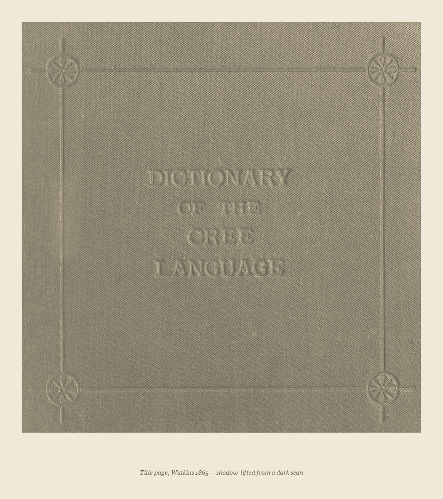
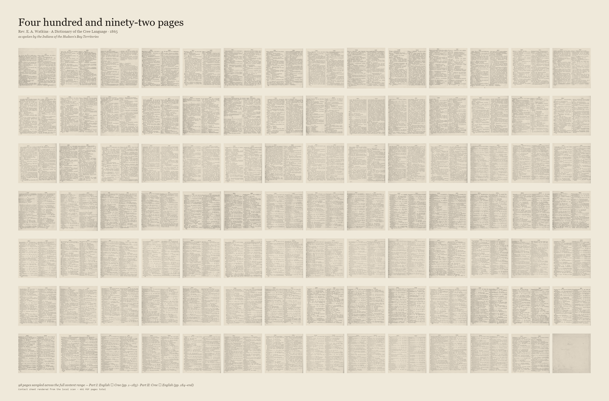
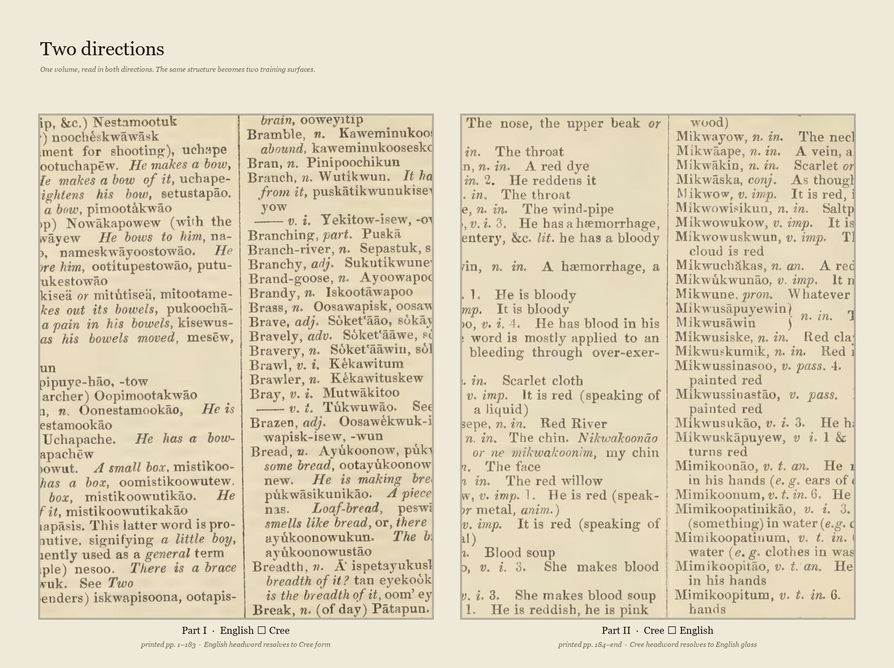
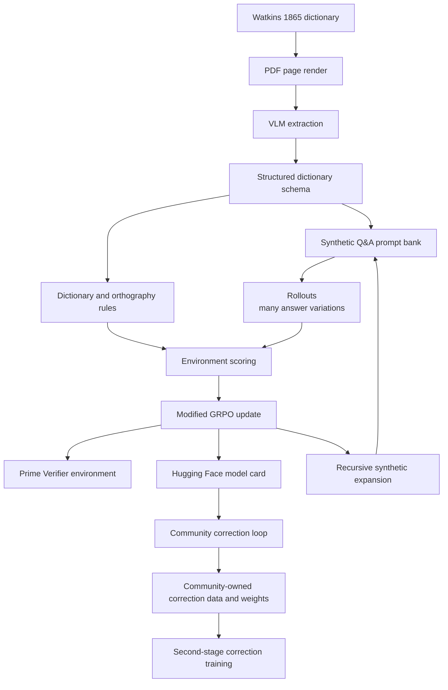
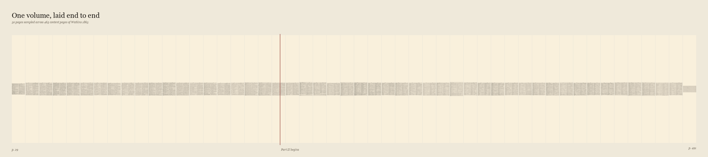
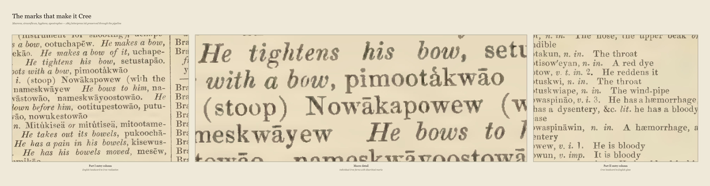

# Cree1865

> **Completed training run:** `cree1865-synthetic-expansion-v1` launched on
> 2026-06-26 with the Cree-specific rubric, expanded synthetic Q&A prompts,
> `Qwen/Qwen3-30B-A3B-Instruct-2507`, `batch-size 16`, `group-size 8`, and
> `max-steps 800`. Inspect the run on
> [W&B](https://wandb.ai/christian-cooper-us/thinking-machines-qwen3-30b/runs/hda2wqhl)
> and test the final sampler through the
> [Cree1865 Tinker Inference Space](https://huggingface.co/spaces/HarleyCooper/Cree1865-Tinker-Inference).
> Read the local run plan in
> [`docs/cree_synthetic_expansion_training.md`](docs/cree_synthetic_expansion_training.md).

<p align="center">
  
</p>

> **Cree1865 is a hypothesis test: can one historical language volume be enough to build, train, publish, and improve a working low-resource language model?**[^single-volume]

Cree1865 is the second public model artifact in this research line after the
Dakota1890 experiment.[^published-artifact] It adapts the same basic idea to a
new language and a new source: Rev. E. A. Watkins' 1865 *A Dictionary of the
Cree Language*. The claim is deliberately narrow but ambitious: a single
structured volume can create enough initial training surface for a LoRA adapter
and a modified GRPO reward loop to become useful enough for community review,
correction, and second-stage training.[^lora][^grpo]

<p align="center">
  <a href="docs/story/index.html">
    
  </a>
  <br>
  <em>Visual record: 98 pages sampled from the full content range. <a href="docs/story/index.html">Open the story &rarr;</a></em>
</p>

This is not a claim that the current model is fluent Cree. It is a claim that
the full pipeline now exists: source extraction, synthetic question-answer
generation, deterministic reward design, Tinker training, a published Prime
Verifier environment, and a Hugging Face model card. The hard test remains
local and human: can the relevant Cree-speaking community judge, correct, and
make the model fluent by its own standards?[^community-test]

## Published Artifacts

| Artifact | Status |
|---|---|
| GitHub repository | `HarleyCoops/Cree1865` |
| Hugging Face model card | [`HarleyCooper/Cree1865`](https://huggingface.co/HarleyCooper/Cree1865) |
| Prime Verifier environment | `harleycooper/cree1865-dictionary-qa` v0.1.2 |
| Live W&B training run | [`hda2wqhl`](https://wandb.ai/christian-cooper-us/thinking-machines-qwen3-30b/runs/hda2wqhl) |
| Hugging Face inference Space | [`HarleyCooper/Cree1865-Tinker-Inference`](https://huggingface.co/spaces/HarleyCooper/Cree1865-Tinker-Inference) |
| Explained W&B dashboard | [`Cree1865 Synthetic Expansion V1 Explained Dashboard`](https://wandb.ai/christian-cooper-us/thinking-machines-qwen3-30b/reports/Cree1865-Synthetic-Expansion-V1-Explained-Dashboard--VmlldzoxNzM1MDY2MQ==) |
| 3D metrics companion | [`visualizations/cree3d`](visualizations/cree3d) |
| Live run details | [`docs/cree_synthetic_expansion_training.md`](docs/cree_synthetic_expansion_training.md) |

## Why Synthetic Q&A Can Still Teach Something

The first objection is the right one: *how can a model learn a living language
from synthetic data?* It cannot learn the whole language from synthetic data.
That is not the claim.

The point of the synthetic question-answer stage is to artificially create
surface area: many small views of the relationships already present in the
source text. A dictionary entry is not just a word pair. It contains direction,
orthography, glosses, examples, variants, usage notes, and implied contrasts.
The Q&A generator turns those relationships into thousands of trainable
prompts.[^synthetic-surface]

In this setup, synthetic data is a bootstrap layer. It moves the base model
closer to the target language space, close enough that a small LoRA update can
specialize behavior without retraining the full model. Then the community loop
does the part synthetic data cannot do: fluent speakers correct the model's
wrong answers, add context, and supply the living judgments that are absent
from the old book.[^correction-loop]

The intended second training stage is not simply "right answer / wrong answer."
The correction record should preserve three things:

1. The prompt the model saw.
2. The model's flawed answer.
3. The speaker's correction, ideally with explanation, context, usage, or story.

That triplet is more valuable than a flat replacement answer because it teaches
the model what kind of mistake it made. A bare correction says "say this
instead." A narrative correction says why the first answer failed.

## How Q&A Pairs Work Inside RL Training

In the RL stage, a synthetic Q&A pair is not treated as a final truth object to
memorize. It is treated as a prompt that can produce many candidate answers.
For each prompt, the policy samples answer variations, sometimes called
rollouts. The Cree environment then scores those variations against explicit
rules: exact answer, answer containment, orthography preservation, character
overlap, and concise length.[^qa-rl]

That means the training run is not simply "show the model a synthetic question
and copy the synthetic answer." It is closer to throwing synthetic 1865 dialogue
against a rule surface and asking which outputs survive. The model gets better
when its sampled outputs satisfy more of the verifier, and the reward ledger
shows which rule channels are improving or failing.

This also creates room for recursive expansion. A short dictionary lookup can
be turned into longer prompts, reverse-direction prompts, contrastive prompts,
orthography-sensitive prompts, and multi-clue prompts. The system can then
sample longer answers and score them against the same source-bounded rules. In
that sense the training surface is combinatorially large, though not literally
infinite and not free to invent beyond the source and verifier.[^recursive-expansion]

The community-in-the-loop phase begins after this archival and synthetic surface
has been pushed as far as the rules can honestly take it. At that point, fluent
speakers are not merely annotators for someone else's model. The intended end
state is that the community has its own correction data, its own adapter
weights, and authority over what counts as better language behavior. Language is
not just content; it is a core part of human identity, memory, and sovereignty.[^language-sovereignty]

## The Source: Watkins 1865

Watkins 1865 is a bilingual dictionary printed under missionary and colonial
conditions. That matters. It is valuable because it preserves a large structured
record of Cree forms, but it is not neutral, complete, or community-authoritative
on its own.[^watkins]

| Part | Direction | Printed pages | Local PDF pages | Current state |
|---|---|---:|---:|---|
| Front matter | pronunciation key and notes | i-xx | 1-28 | reference only |
| Part I | English to Cree | 1-183 | 29-210 | extracted |
| Part II | Cree to English | 184-end | 212-end | extracted |

Local source files:

- `CreeDictionary.pdf`
- `sources/CreeDictionary_1865_cihm_41985_complete.pdf`
- Internet Archive identifier: `cihm_41985`

A full visual record of the source — contact sheet, panoramic scope ribbon, orthography macro detail, and a verified archival inventory of Watkins' surviving papers — is in [`docs/story/`](docs/story/index.html).

<p align="center">
  
  <br>
  <em>Part I, page 1, local PDF page 29: English headword to Cree realization.</em>
</p>

<p align="center">
  
  <br>
  <em>Two directions: Part I (English &rarr; Cree) and Part II (Cree &rarr; English) &mdash; the bidirectional structure that seeds both RL task surfaces.</em>
</p>

## Pipeline



The key engineering move is that the source becomes executable supervision. The
system does not need a large parallel corpus to begin. It needs a source with
enough internal structure to generate tasks and a reward function that makes
mistakes visible.

## Extraction Snapshot

<p align="center">
  
  <br>
  <em>Fifty pages laid end to end &mdash; the physical breadth of one volume.</em>
</p>

Confirmed from the full local build on 2026-06-24:

| Measure | Count |
|---|---:|
| Extracted page JSON files | 463 |
| Raw entries | 19,607 |
| Deduplicated usable entries | 19,560 |
| Multi-variant entries | 4,049 |
| SFT train / validation records | 18,463 / 972 |
| RL task records | 38,870 |
| English to Cree RL tasks | 19,435 |
| Cree to English RL tasks | 19,435 |

Dataset root:

```text
data/cree_goal_run_20260624_full_dictionary/
```

Main RL task file:

```text
data/cree_goal_run_20260624_full_dictionary/training_datasets/rl_tasks_all.jsonl
```

The generated data is ignored by git because it is large. The extraction and
dataset-building code is tracked so the artifacts can be regenerated.

## Reward Function

The Cree verifier is intentionally not the Dakota verifier. It is a
Cree-specific dictionary lookup environment, published to Prime as:

```text
harleycooper/cree1865-dictionary-qa
```

The current reward surface is deterministic and does not use an LLM judge:

```python
reward = (
    0.20 * exact_match +
    0.25 * target_containment +
    0.20 * orthography_recall +
    0.20 * character_f1 +
    0.15 * concise_length
)
```

| Channel | Weight | What it checks |
|---|---:|---|
| Exact match | 0.20 | Normalized response equals the Watkins-derived answer |
| Target containment | 0.25 | Expected answer appears inside the response |
| Orthography recall | 0.20 | Cree marks, hyphens, apostrophes, and accents are preserved |
| Character F1 | 0.20 | Spelling-level overlap for near misses |
| Concise length | 0.15 | The model does not pad a lookup answer with unsupported text |

<p align="center">
  
  <br>
  <em>The marks the reward function must preserve &mdash; macrons, circumflexes, hyphens, apostrophes in 1865 letterpress.</em>
</p>

This matters for interpretability. If the model fails, the failure is not just
"bad answer." It can fail because it missed the target, lost the orthography,
drifted into a long hallucinated explanation, or preserved characters without
getting the answer right. Those failures can be counted, inspected, and shown to
linguists and community reviewers.[^interpretability]

## Live Synthetic Expansion Run

The current public run is the synthetic-expansion experiment launched on
2026-06-26. It replaces the smaller direct-lookup task surface with anchored
prompt variants generated from the same extracted Watkins dictionary answers.
The answers remain dictionary-bound; only the question surface changes.

| Field | Value |
|---|---|
| W&B run | [`hda2wqhl`](https://wandb.ai/christian-cooper-us/thinking-machines-qwen3-30b/runs/hda2wqhl) |
| Run name | `cree1865-synthetic-expansion-v1` |
| Tinker session | `9d734fdb-7851-5f2f-9949-e9e574eb9a55` |
| Base model | `Qwen/Qwen3-30B-A3B-Instruct-2507` |
| Method | grouped rollout RL with Tinker `importance_sampling` objective |
| Rubric | `cree` |
| Dataset | `rl_tasks_synthetic_expanded_balanced.jsonl` |
| Eval file | `rl_tasks_synthetic_expanded_balanced_eval.jsonl` |
| Anchored Q&A rows | 38,870 |
| Synthetic RL rows before balancing | 272,090 |
| Balanced training rows | 490,280 |
| Eval probe rows | 2,048 |
| Direction balance | 245,140 English->Cree / 245,140 Cree->English |
| Batch size / group size | 16 / 8 |
| Planned steps | 800 |
| Approximate rollout budget | 102,400 sampled completions before eval overhead |
| LoRA rank | 32 |
| Local log path | `dakota_rl_training/outputs/cree1865_synthetic_expansion_v1` |

The live dashboard should be read through per-channel movement and direction
asymmetry, not the scalar reward alone. A lookup rubric's absolute reward is
rubric-shaped; the important questions are whether English->Cree generation,
Cree orthography preservation, exact/containment channels, and Cree->English
reverse lookup improve under held-out prompts.

The native W&B explained dashboard is the primary visualization surface:

```text
https://wandb.ai/christian-cooper-us/thinking-machines-qwen3-30b/reports/Cree1865-Synthetic-Expansion-V1-Explained-Dashboard--VmlldzoxNzM1MDY2MQ==
```

It pairs W&B charts with short descriptions of what each metric means, including
reward channels, direction asymmetry, entropy/KL behavior, throughput, and
expert-token utilization. The optional Three.js companion in
[`visualizations/cree3d`](visualizations/cree3d) is a local shape-of-training
view: each visible metric becomes a normalized 3D ribbon over training step. It
is useful for spotting timing relationships, but it should not replace the W&B
plots when reading exact values.

Refresh and run the local companion:

```bash
python scripts/analysis/export_cree_3d_metrics.py
cd visualizations/cree3d
npm install
npm run dev
```

For the exact expansion and launch commands, see
[`docs/cree_synthetic_expansion_training.md`](docs/cree_synthetic_expansion_training.md).

## The Core Test Still Ahead

The real test is not a benchmark score. The real test is whether people with
living authority over the language can use the model, correct it, and make it
better.

For Cree1865, that means asking:

- Can modern Cree speakers recognize useful structure in a model bootstrapped
  from the Watkins dictionary?
- Can the model's errors be corrected quickly enough to justify the method?
- Do narrative corrections create a better second LoRA dataset than flat answer
  replacement?
- Does the method transfer to other low-resource languages with only one strong
  historical source?
- Can geographic and historical source work, such as Dawson-style map alignment,
  help connect archival language artifacts to the communities best positioned
  to judge them?[^dawson]

The strongest version of the hypothesis is global: a trained linguist,
community partner, or academic team should be able to take a single structured
source volume from any low-resource language, produce a first model, expose its
mistakes, collect local corrections, and iterate.

That is still a hypothesis, not a conclusion.

## Why This Is Also an Interpretability Project

Cree1865 is not only about translation. It is about whether a low-resource
language model can be made legible while it learns.

The broader speculative question is whether language models expose something
about how human languages share a common cognitive substrate while expressing
different cultural and environmental histories. In that framing, a language is
not merely a code for English meanings. It is a way of organizing attention:
what distinctions matter, what relationships are lexicalized, what forms become
natural because a community repeatedly needed them.[^cognitive-substrate]

That is why the reward function should stay visible. A hidden scalar reward
would make the system harder to trust. A decomposed reward ledger lets reviewers
ask concrete questions:

- Is the model learning orthography or only memorizing fragments?
- Does it get one direction right but fail the reverse direction?
- Are failures clustered around old source spellings?
- Do community corrections shift the same error channels that the verifier
  identifies?

## Current Limitations

- The source is a missionary-era dictionary with colonial framing. Choosing a
  public-domain 1865 source is deliberate: it avoids collecting living speakers'
  language without consent, and it keeps provenance honest — the artifact is
  openly archival and does not impersonate contemporary Cree. Old is *safer* on
  consent and provenance, but it is not neutral, not correct, and does not by
  itself settle community authority over the derived weights.
- "Cree" is a dialect continuum (Plains/y, Woods/th, Swampy/n, Moose/l, East),
  not one standardized language. Watkins 1865 records one 19th-century Hudson's
  Bay variety through a missionary's ear; it must never be presented as "the"
  Cree language.
- The reward function preserves Roman-orthography marks and does **not** handle
  Cree syllabics, so the current tool may not serve the communities that read and
  write primarily in syllabics.
- There is **no named community partner with authority over this artifact yet**.
  Community involvement is presently a roadmap item, which means the model was
  built before the people it concerns were in the loop. The intended end state is
  community-held correction data and weights, governed under Indigenous data
  frameworks (OCAP®, CARE). See [`SOURCE_NOTES.md`](SOURCE_NOTES.md) for the full
  governance statement.
- A model smooths uncertainty into fluent-sounding confidence; this one must be
  treated as a starting point for correction, never as a source of truth about
  how Cree is spoken.
- The extraction may preserve scan errors, source errors, and VLM mistakes.
- Many tasks are dictionary lookups, not natural conversation.
- The current reward verifies lookup behavior, not full communicative fluency.
- The Hugging Face repository currently publishes the model card; deployable
  adapter packaging remains part of the publication path.[^published-artifact]
- No community has certified the model as fluent, authoritative, or safe for
  language instruction.

## How to Use the Published Verifier

Install the Prime environment:

```bash
prime env install harleycooper/cree1865-dictionary-qa
```

Run the local package smoke path:

```bash
cd environments/cree1865_dictionary_qa
uv pip install -e .
uv run vf-eval cree1865_dictionary_qa -n 5 -r 1
```

Target adapter interface once adapter files are published:

```python
from transformers import AutoModelForCausalLM, AutoTokenizer
from peft import PeftModel

base = "Qwen/Qwen3-30B-A3B-Instruct-2507"
adapter = "HarleyCooper/Cree1865"  # final adapter files are not yet published

model = AutoModelForCausalLM.from_pretrained(base, device_map="auto", trust_remote_code=True)
tok = AutoTokenizer.from_pretrained(base)
model = PeftModel.from_pretrained(model, adapter)
```

## Roadmap

| Stage | Status |
|---|---|
| Source secured and bounded | done |
| Full dictionary extraction | done |
| SFT and RL task generation | done |
| Cree-specific Prime Verifier | done |
| Synthetic expansion dataset | done |
| 800-step synthetic-expansion Tinker run | running |
| Hugging Face model card | live-run update |
| Adapter packaging on Hugging Face | planned |
| Community correction interface | planned |
| Second-stage correction LoRA training | planned |
| Community fluency evaluation | planned |

## Citation

```bibtex
@misc{cree1865,
  title        = {Cree1865: A Single-Volume GRPO Experiment for Cree Language Modeling},
  author       = {Cooper, Christian Harley},
  year         = {2026},
  howpublished = {\url{https://github.com/HarleyCoops/Cree1865}},
  note         = {Source: Watkins, E. A. (1865). A Dictionary of the Cree Language.
                  London. Internet Archive: cihm\_41985.}
}
```

## Footnotes

[^single-volume]: "Enough" means enough to create a first runnable model and correction loop, not enough to replace fluent speakers or contemporary community authority.

[^published-artifact]: "Published model artifact" refers to the public Hugging Face repository and model card for `HarleyCooper/Cree1865`, plus the Prime Verifier environment and live Tinker/W&B training record. The Hugging Face repo currently contains the card metadata; final adapter packaging remains a roadmap item.

[^lora]: LoRA, or Low-Rank Adaptation, trains a small set of adapter weights instead of updating every parameter in the base model. That makes repeated retraining practical when new correction data arrives.

[^grpo]: GRPO means Group Relative Policy Optimization. In this project, the important property is not the acronym but the reward design: multiple sampled answers can be compared against deterministic dictionary-derived checks.

[^community-test]: Community validation is not a courtesy step after the technical work. It is the actual evaluation target. A language model that cannot be corrected and judged by speakers has not passed the test.

[^synthetic-surface]: Synthetic Q&A pairs are not treated as community speech. They are a way to expose relationships already present in the archival source so the model has enough supervised surface to begin adapting.

[^correction-loop]: The correction-loop idea is modeled as prompt, flawed answer, and narrative correction. The narrative part is essential because it can carry usage, register, humor, context, and cultural judgment that a dictionary lookup cannot contain.

[^qa-rl]: In this README, "rollout" means one sampled model answer to a prompt during RL training. Grouped rollouts let the reward function compare multiple answer attempts for the same underlying question.

[^recursive-expansion]: "Near infinite" here means practically expandable through combinations of source entries, directions, prompt styles, answer lengths, and rule checks. It does not mean the system can create unlimited reliable language data without source constraints or human review.

[^language-sovereignty]: The technical goal is not to centralize authority over a language in a model repository. It is to make a first model that a community can inspect, correct, govern, and, where desired, retrain into community-held weights.

[^watkins]: Watkins, E. A. (1865). *A Dictionary of the Cree Language, as Spoken by the Indians of the Hudson's Bay Territories.* London: Society for Promoting Christian Knowledge. Internet Archive identifier: `cihm_41985`.

[^interpretability]: Interpretability here is practical rather than mystical: every reward channel is named, logged, and inspectable, so failures can be attributed to specific behavior instead of hidden behind a single score.

[^dawson]: Dawson-style map alignment is a parallel research path for connecting historical sources to geography. It does not by itself establish contemporary identity, permission, or authority; it helps formulate better local questions.

[^cognitive-substrate]: This is a research hypothesis, not an empirical conclusion from Cree1865. The careful version is that language technologies may help compare how different languages encode attention, relation, environment, and social practice when the reward surface is explicit enough to inspect.
