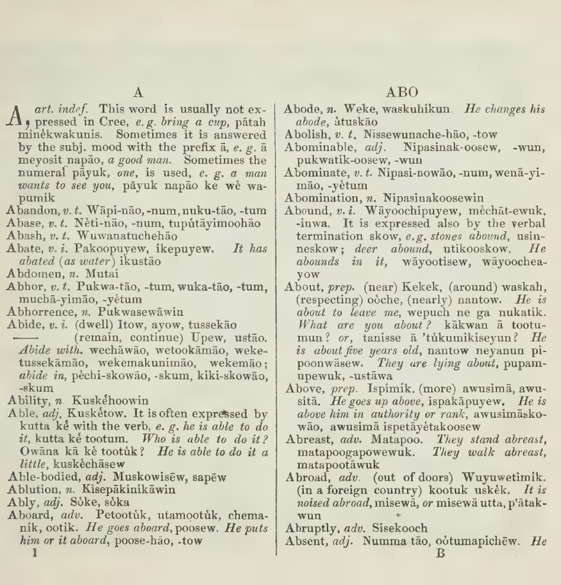
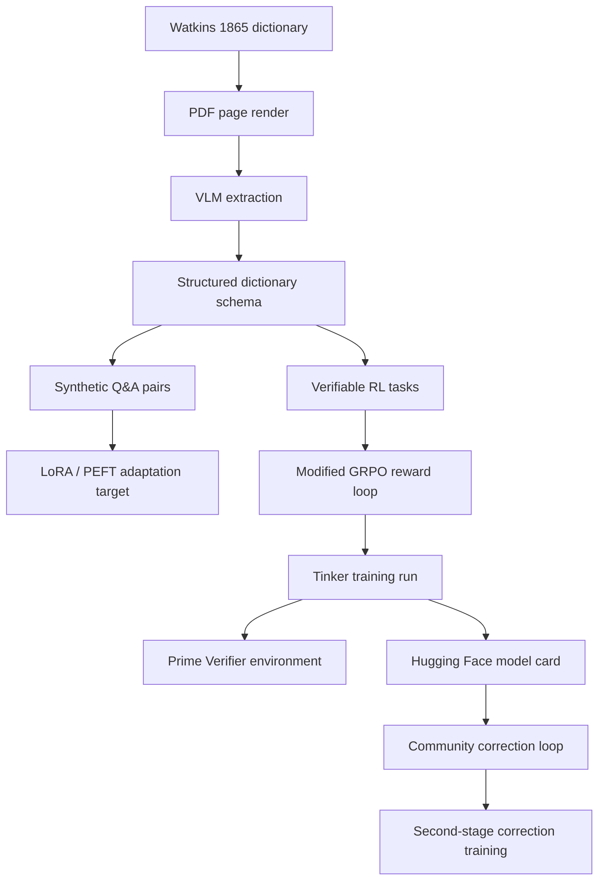

# Cree1865

> **Cree1865 is a hypothesis test: can one historical language volume be enough to build, train, publish, and improve a working low-resource language model?**[^single-volume]

Cree1865 is the second public model artifact in this research line after the
Dakota1890 experiment.[^published-artifact] It adapts the same basic idea to a
new language and a new source: Rev. E. A. Watkins' 1865 *A Dictionary of the
Cree Language*. The claim is deliberately narrow but ambitious: a single
structured volume can create enough initial training surface for a LoRA adapter
and a modified GRPO reward loop to become useful enough for community review,
correction, and second-stage training.[^lora][^grpo]

This is not a claim that the current model is fluent Cree. It is a claim that
the full pipeline now exists: source extraction, synthetic question-answer
generation, deterministic reward design, Tinker training, a published Prime
Verifier environment, and a Hugging Face model card. The hard test remains
local and human: can the relevant Cree-speaking community judge, correct, and
make the model fluent by its own standards?[^community-test]

## Published Artifacts

| Artifact | Status |
|---|---|
| GitHub repository | `HarleyCoops/Cree1865` |
| Hugging Face model card | [`HarleyCooper/Cree1865`](https://huggingface.co/HarleyCooper/Cree1865) |
| Prime Verifier environment | `harleycooper/cree1865-dictionary-qa` v0.1.2 |
| W&B training run | [`kjn02ee4`](https://wandb.ai/christian-cooper-us/cree1865-tinker/runs/kjn02ee4) |
| Tinker final weights reference | `tinker://bf25e2aa-6b3a-557c-8133-fadf5ebcba8f:train:0/weights/final` |

## Why Synthetic Q&A Can Still Teach Something

The first objection is the right one: *how can a model learn a living language
from synthetic data?* It cannot learn the whole language from synthetic data.
That is not the claim.

The point of the synthetic question-answer stage is to artificially create
surface area: many small views of the relationships already present in the
source text. A dictionary entry is not just a word pair. It contains direction,
orthography, glosses, examples, variants, usage notes, and implied contrasts.
The Q&A generator turns those relationships into thousands of trainable
prompts.[^synthetic-surface]

In this setup, synthetic data is a bootstrap layer. It moves the base model
closer to the target language space, close enough that a small LoRA update can
specialize behavior without retraining the full model. Then the community loop
does the part synthetic data cannot do: fluent speakers correct the model's
wrong answers, add context, and supply the living judgments that are absent
from the old book.[^correction-loop]

The intended second training stage is not simply "right answer / wrong answer."
The correction record should preserve three things:

1. The prompt the model saw.
2. The model's flawed answer.
3. The speaker's correction, ideally with explanation, context, usage, or story.

That triplet is more valuable than a flat replacement answer because it teaches
the model what kind of mistake it made. A bare correction says "say this
instead." A narrative correction says why the first answer failed.

## The Source: Watkins 1865

Watkins 1865 is a bilingual dictionary printed under missionary and colonial
conditions. That matters. It is valuable because it preserves a large structured
record of Cree forms, but it is not neutral, complete, or community-authoritative
on its own.[^watkins]

| Part | Direction | Printed pages | Local PDF pages | Current state |
|---|---|---:|---:|---|
| Front matter | pronunciation key and notes | i-xx | 1-28 | reference only |
| Part I | English to Cree | 1-183 | 29-210 | extracted |
| Part II | Cree to English | 184-end | 212-end | extracted |

Local source files:

- `CreeDictionary.pdf`
- `sources/CreeDictionary_1865_cihm_41985_complete.pdf`
- Internet Archive identifier: `cihm_41985`

<p align="center">
  
  <br>
  <em>Part I, page 1, local PDF page 29: English headword to Cree realization.</em>
</p>

## Pipeline



The key engineering move is that the source becomes executable supervision. The
system does not need a large parallel corpus to begin. It needs a source with
enough internal structure to generate tasks and a reward function that makes
mistakes visible.

## Extraction Snapshot

Confirmed from the full local build on 2026-06-24:

| Measure | Count |
|---|---:|
| Extracted page JSON files | 463 |
| Raw entries | 19,607 |
| Deduplicated usable entries | 19,560 |
| Multi-variant entries | 4,049 |
| SFT train / validation records | 18,463 / 972 |
| RL task records | 38,870 |
| English to Cree RL tasks | 19,435 |
| Cree to English RL tasks | 19,435 |

Dataset root:

```text
data/cree_goal_run_20260624_full_dictionary/
```

Main RL task file:

```text
data/cree_goal_run_20260624_full_dictionary/training_datasets/rl_tasks_all.jsonl
```

The generated data is ignored by git because it is large. The extraction and
dataset-building code is tracked so the artifacts can be regenerated.

## Reward Function

The Cree verifier is intentionally not the Dakota verifier. It is a
Cree-specific dictionary lookup environment, published to Prime as:

```text
harleycooper/cree1865-dictionary-qa
```

The current reward surface is deterministic and does not use an LLM judge:

```python
reward = (
    0.20 * exact_match +
    0.25 * target_containment +
    0.20 * orthography_recall +
    0.20 * character_f1 +
    0.15 * concise_length
)
```

| Channel | Weight | What it checks |
|---|---:|---|
| Exact match | 0.20 | Normalized response equals the Watkins-derived answer |
| Target containment | 0.25 | Expected answer appears inside the response |
| Orthography recall | 0.20 | Cree marks, hyphens, apostrophes, and accents are preserved |
| Character F1 | 0.20 | Spelling-level overlap for near misses |
| Concise length | 0.15 | The model does not pad a lookup answer with unsupported text |

This matters for interpretability. If the model fails, the failure is not just
"bad answer." It can fail because it missed the target, lost the orthography,
drifted into a long hallucinated explanation, or preserved characters without
getting the answer right. Those failures can be counted, inspected, and shown to
linguists and community reviewers.[^interpretability]

## Training Run

| Field | Value |
|---|---|
| Base model | `Qwen/Qwen3.5-4B` |
| Method | modified GRPO with deterministic reward ledger |
| Renderer | `qwen3_5_disable_thinking` |
| Steps | 1200 |
| Batch size / group size | 2 / 2 |
| Max sampled tokens | 64 |
| W&B run | [`kjn02ee4`](https://wandb.ai/christian-cooper-us/cree1865-tinker/runs/kjn02ee4) |
| Final reward | 0.21 |
| Deduped mean reward | 0.18260238803447346 |
| Final parse success | 1.0 |
| Deduped mean parse success | 0.99875 |
| Final weights reference | `tinker://bf25e2aa-6b3a-557c-8133-fadf5ebcba8f:train:0/weights/final` |
| Sampler weights reference | `tinker://bf25e2aa-6b3a-557c-8133-fadf5ebcba8f:train:0/sampler_weights/final` |

The first Tinker session stalled at local step 868 and was resumed under the
same W&B run ID from checkpoint 800. The raw ledger therefore includes 69 replay
rows; the deduped ledger keeps one row per step for steps 0-1199.

The run proves that the full-dictionary training path can execute end to end.
It does not prove that the resulting model is fluent or community-ready.

## The Core Test Still Ahead

The real test is not a benchmark score. The real test is whether people with
living authority over the language can use the model, correct it, and make it
better.

For Cree1865, that means asking:

- Can modern Cree speakers recognize useful structure in a model bootstrapped
  from the Watkins dictionary?
- Can the model's errors be corrected quickly enough to justify the method?
- Do narrative corrections create a better second LoRA dataset than flat answer
  replacement?
- Does the method transfer to other low-resource languages with only one strong
  historical source?
- Can geographic and historical source work, such as Dawson-style map alignment,
  help connect archival language artifacts to the communities best positioned
  to judge them?[^dawson]

The strongest version of the hypothesis is global: a trained linguist,
community partner, or academic team should be able to take a single structured
source volume from any low-resource language, produce a first model, expose its
mistakes, collect local corrections, and iterate.

That is still a hypothesis, not a conclusion.

## Why This Is Also an Interpretability Project

Cree1865 is not only about translation. It is about whether a low-resource
language model can be made legible while it learns.

The broader speculative question is whether language models expose something
about how human languages share a common cognitive substrate while expressing
different cultural and environmental histories. In that framing, a language is
not merely a code for English meanings. It is a way of organizing attention:
what distinctions matter, what relationships are lexicalized, what forms become
natural because a community repeatedly needed them.[^cognitive-substrate]

That is why the reward function should stay visible. A hidden scalar reward
would make the system harder to trust. A decomposed reward ledger lets reviewers
ask concrete questions:

- Is the model learning orthography or only memorizing fragments?
- Does it get one direction right but fail the reverse direction?
- Are failures clustered around old source spellings?
- Do community corrections shift the same error channels that the verifier
  identifies?

## Current Limitations

- The source is a missionary-era dictionary with colonial framing.
- The extraction may preserve scan errors, source errors, and VLM mistakes.
- Many tasks are dictionary lookups, not natural conversation.
- The current reward verifies lookup behavior, not full communicative fluency.
- The Hugging Face repository currently publishes the model card; deployable
  adapter packaging remains part of the publication path.[^published-artifact]
- No community has certified the model as fluent, authoritative, or safe for
  language instruction.

## How to Use the Published Verifier

Install the Prime environment:

```bash
prime env install harleycooper/cree1865-dictionary-qa
```

Run the local package smoke path:

```bash
cd environments/cree1865_dictionary_qa
uv pip install -e .
uv run vf-eval cree1865_dictionary_qa -n 5 -r 1
```

Target adapter interface once adapter files are published:

```python
from transformers import AutoModelForCausalLM, AutoTokenizer
from peft import PeftModel

base = "Qwen/Qwen3.5-4B"
adapter = "HarleyCooper/Cree1865"

model = AutoModelForCausalLM.from_pretrained(base, device_map="auto", trust_remote_code=True)
tok = AutoTokenizer.from_pretrained(base)
model = PeftModel.from_pretrained(model, adapter)
```

## Roadmap

| Stage | Status |
|---|---|
| Source secured and bounded | done |
| Full dictionary extraction | done |
| SFT and RL task generation | done |
| Cree-specific Prime Verifier | done |
| 1200-step Tinker run | done |
| Hugging Face model card | done |
| Adapter packaging on Hugging Face | planned |
| Community correction interface | planned |
| Second-stage correction LoRA training | planned |
| Community fluency evaluation | planned |

## Citation

```bibtex
@misc{cree1865,
  title        = {Cree1865: A Single-Volume GRPO Experiment for Cree Language Modeling},
  author       = {Cooper, Christian Harley},
  year         = {2026},
  howpublished = {\url{https://github.com/HarleyCoops/Cree1865}},
  note         = {Source: Watkins, E. A. (1865). A Dictionary of the Cree Language.
                  London. Internet Archive: cihm\_41985.}
}
```

## Footnotes

[^single-volume]: "Enough" means enough to create a first runnable model and correction loop, not enough to replace fluent speakers or contemporary community authority.

[^published-artifact]: "Published model artifact" refers to the public Hugging Face repository and model card for `HarleyCooper/Cree1865`, plus the Prime Verifier environment and Tinker weight references recorded in this repo. The Hugging Face repo currently contains the card metadata; final adapter packaging remains a roadmap item.

[^lora]: LoRA, or Low-Rank Adaptation, trains a small set of adapter weights instead of updating every parameter in the base model. That makes repeated retraining practical when new correction data arrives.

[^grpo]: GRPO means Group Relative Policy Optimization. In this project, the important property is not the acronym but the reward design: multiple sampled answers can be compared against deterministic dictionary-derived checks.

[^community-test]: Community validation is not a courtesy step after the technical work. It is the actual evaluation target. A language model that cannot be corrected and judged by speakers has not passed the test.

[^synthetic-surface]: Synthetic Q&A pairs are not treated as community speech. They are a way to expose relationships already present in the archival source so the model has enough supervised surface to begin adapting.

[^correction-loop]: The correction-loop idea is modeled as prompt, flawed answer, and narrative correction. The narrative part is essential because it can carry usage, register, humor, context, and cultural judgment that a dictionary lookup cannot contain.

[^watkins]: Watkins, E. A. (1865). *A Dictionary of the Cree Language, as Spoken by the Indians of the Hudson's Bay Territories.* London: Society for Promoting Christian Knowledge. Internet Archive identifier: `cihm_41985`.

[^interpretability]: Interpretability here is practical rather than mystical: every reward channel is named, logged, and inspectable, so failures can be attributed to specific behavior instead of hidden behind a single score.

[^dawson]: Dawson-style map alignment is a parallel research path for connecting historical sources to geography. It does not by itself establish contemporary identity, permission, or authority; it helps formulate better local questions.

[^cognitive-substrate]: This is a research hypothesis, not an empirical conclusion from Cree1865. The careful version is that language technologies may help compare how different languages encode attention, relation, environment, and social practice when the reward surface is explicit enough to inspect.
