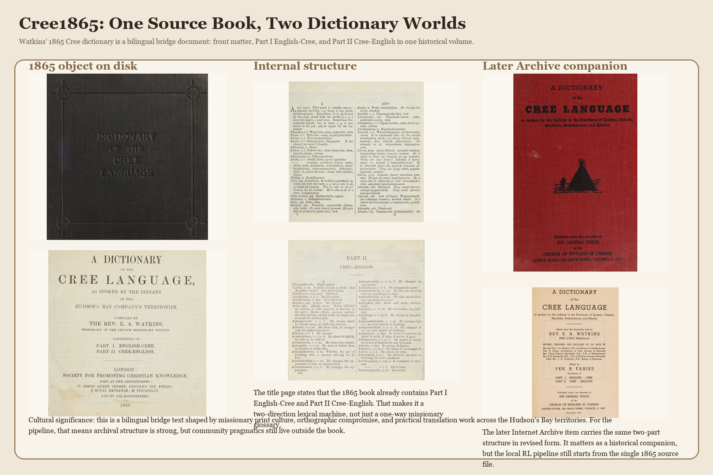
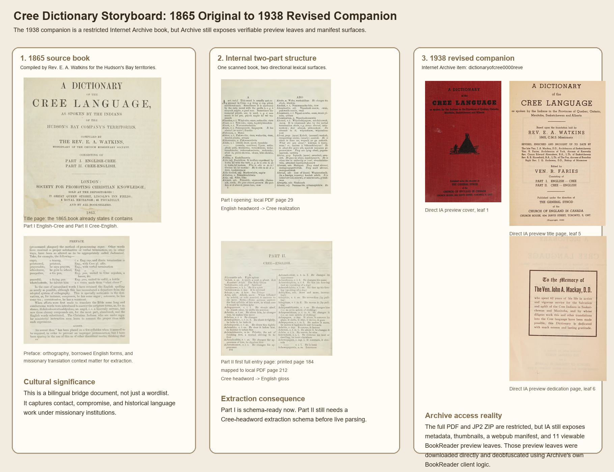
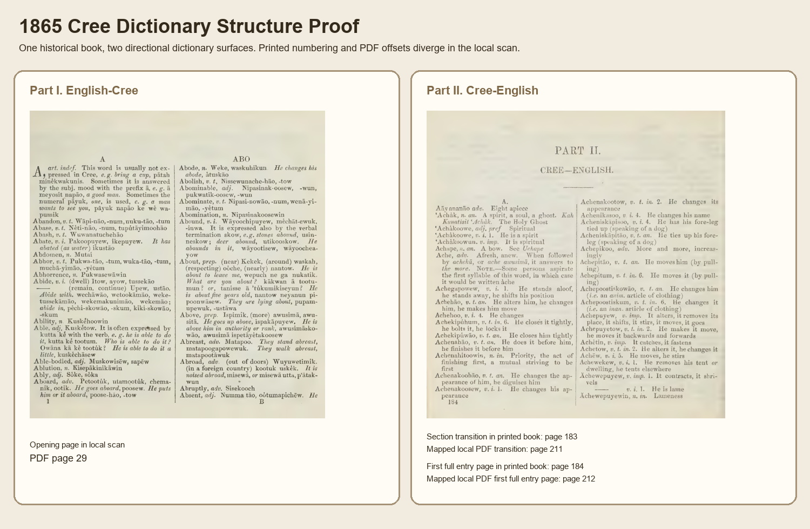
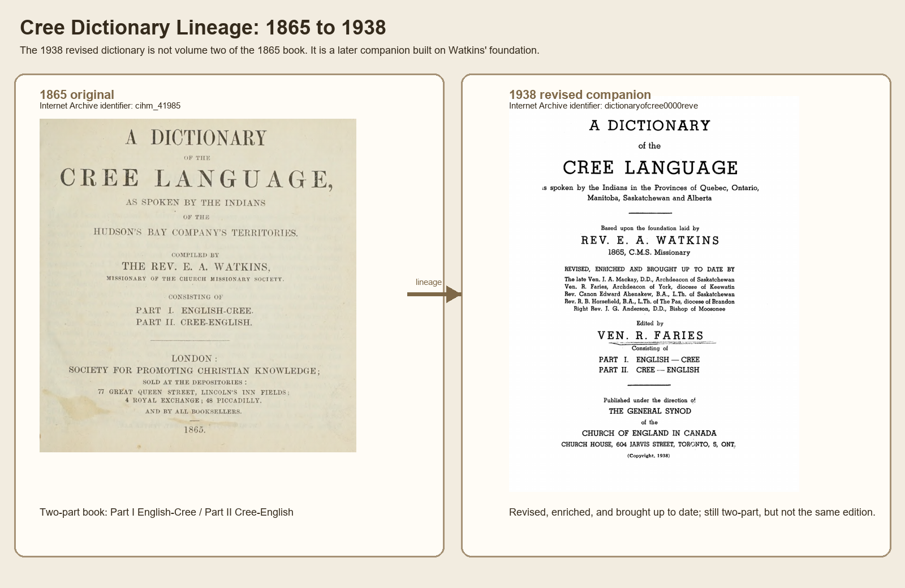
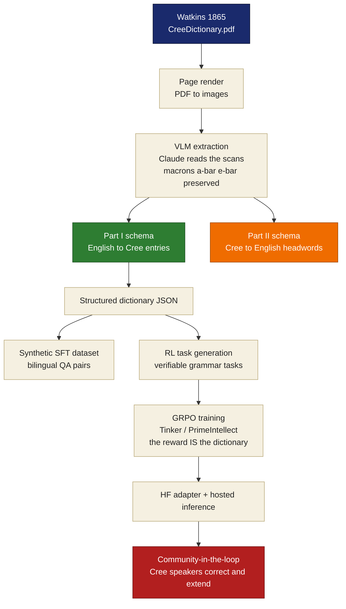

<!-- ╔══════════════════════════════════════════════════════════════════════════╗
     ║  CREE1865 · SHOWCASE README                                                ║
     ║  Forward-looking design. Confirmed facts are live; values that only exist  ║
     ║  after the training run are marked  ‹PENDING FINAL RUN›  and styled in     ║
     ║  italics so nothing reads as finished before it is.                        ║
     ╚══════════════════════════════════════════════════════════════════════════╝ -->

<!-- ───────────────────────────  HERO  ─────────────────────────── -->
<div align="center">



<br>


<!-- animated tagline -->
<a href="#the-thesis">
  
</a>

<br><br>

<!-- ─────────────  BADGE WALL  ───────────── -->
<a href="LICENSE"></a>
<a href="DATA_LICENSE.md"></a>

<br>


<br><br>

<!-- ─────────────  NAV  ───────────── -->
<b>
<a href="#the-thesis">Thesis</a> &nbsp;·&nbsp;
<a href="#the-source--one-book-two-worlds">The Source</a> &nbsp;·&nbsp;
<a href="#the-pipeline--book--reward-loop">Pipeline</a> &nbsp;·&nbsp;
<a href="#extraction-at-a-glance">Extraction</a> &nbsp;·&nbsp;
<a href="#the-reward-function">Reward</a> &nbsp;·&nbsp;
<a href="#the-model-arc">Models</a> &nbsp;·&nbsp;
<a href="#roadmap">Roadmap</a> &nbsp;·&nbsp;
<a href="#acknowledgments">Credits</a>
</b>

</div>

---

<!-- ───────────────────────────  THESIS  ─────────────────────────── -->
## The Thesis

> **A 161-year-old dictionary, read cover to cover by a language model — then handed to the community that still speaks the language, to correct the way you correct a child learning to talk.**

To our knowledge this is the first time the *grammar-as-reward* method — proven on the 1890 Dakota grammar in [**Dakota1890**](https://github.com/HarleyCoops/Dakota1890) — has been retargeted to **Cree**, starting from a single public-domain book: **Rev. E. A. Watkins' 1865 _A Dictionary of the Cree Language_**.

The model is not meant to be right on day one. That is the point. It reads the 1865 orthography, the macrons, the affixes, the English↔Cree mappings — and becomes the working endpoint that **contemporary Cree speakers** then correct and extend. That community-in-the-loop second stage is the idea carried over from the companion **StoneyNakoda** project.

The whole chain runs from one book:

<div align="center">

`Watkins 1865` → `VLM extraction` → `structured schema` → `RL tasks` → `GRPO training` → `Hugging Face` → `community correction`

</div>

---

<!-- ───────────────────────────  SOURCE  ─────────────────────────── -->
## The Source — One Book, Two Worlds

<div align="center">

</div>

Watkins 1865 is **not a vocabulary dump**. It is a bilingual bridge object printed under missionary conditions across the Hudson's Bay territories — and it carries **two extraction surfaces inside one volume**:

| Part | Direction | Printed pages | Local PDF pages | Schema state |
|------|-----------|:-------------:|:---------------:|--------------|
| **Front matter** | pronunciation key + early grammar notes | i – xx | 1 – 28 | reference only |
| **Part I** | **English → Cree** | 1 – 183 | **29 – 210** | schema-ready, extracted |
| **Part II** | **Cree → English** | 184 – end | **212 – end** | boundary-mapped, schema pending |

<div align="center">

<br><em>Boundary proof — the same physical book exposes two different lexical layouts.</em>
</div>

### Archival lineage

Two anchors on the Internet Archive make the provenance fully traceable:

<table>
<tr>
<td width="50%" valign="top">

**1865 — the original**
`Internet Archive: cihm_41985`
Watkins' first edition. 492-page local scan; 501-page archive master.

</td>
<td width="50%" valign="top">

**1938 — the revised companion**
`Internet Archive: dictionaryofcree0000reve`
Faries' revision *built on* Watkins — not a second volume. Borrow path is auth-gated; preview leaves preserved in-repo.

</td>
</tr>
</table>

<div align="center">

</div>

<details>
<summary><b>What's preserved in the source dossier</b> (click to expand)</summary>

<br>

- `docs/source_dossier/cree_dictionary_hero_banner.png` — the title hero
- `docs/source_dossier/cree_dictionary_storyboard.png` — 1865→1938 storyboard
- `docs/source_dossier/cree1865_structure_proof.png` — two-part boundary proof
- `docs/source_dossier/cree_second_volume_ia_access_story.png` — IA access / auth-gate evidence
- `docs/source_dossier/screens/local_page_029-029.png` — first Part I dictionary page
- `docs/source_dossier/screens/local_page_212-212.png` — first Part II reverse page
- `docs/source_dossier/internet_archive/` — machine-readable IA manifests, auth probes, BookReader payloads

The blocker state for the 1938 companion is captured as protocol-level JSON, not prose: the item is real, the previews are real, and only the official full-file borrow path is auth-gated.

</details>

---

<!-- ───────────────────────────  PIPELINE  ─────────────────────────── -->
## The Pipeline — Book → Reward Loop

One book becomes a **self-contained training loop**. No parallel corpus, no separate grammar documentation, no OCR training set — the book *is* all of those things.



<div align="center">
<table>
<tr><td align="center"><b>What the model actually reads</b><br><br>

<br><em>Part I, page 1 (PDF 29): English headword → Cree realization,<br>with inline example sentences and usage notes.</em>
</td></tr>
</table>
</div>

**The key move:** the dictionary stops being static documentation and becomes **executable feedback**. Instead of asking the model to imitate text, the RL loop *scores* whether each output satisfies the orthographic, morphological, and translation constraints pulled from Watkins.

---

<!-- ───────────────────────────  EXTRACTION  ─────────────────────────── -->
## Extraction at a Glance

*Confirmed from the Part I (English → Cree) extraction run — 2026-06-24.*

<div align="center">

| | | | |
|:--:|:--:|:--:|:--:|
| **184** | **6,110** | **0.915** | **3,563** |
| pages extracted | dictionary entries | avg VLM confidence | multi-variant entries |
| **6,109** | **67** | **281** | **pending** |
| after dedup | rejected (QA gate) | Part II pages rendered | Part II schema |

</div>

> Downstream sample (reverse Part II slice): **12,084** verifiable RL tasks · **5,739** SFT train / **303** validation pairs.
> *Full-corpus dataset totals are ‹PENDING FINAL RUN› once Part II's Cree-headword schema lands.*

<details>
<summary><b>A real extracted entry</b> (click to expand)</summary>

```jsonc
{
  "english_headword": "A",
  "part_of_speech": "art. indef.",
  "cree_variants": ["pātah minékwakunis", "ā meyosit napāo", "pāyuk"],
  "example_pairs": [
    { "english": "bring a cup",            "cree": "pātah minékwakunis" },
    { "english": "a good man",             "cree": "ā meyosit napāo" },
    { "english": "a man wants to see you", "cree": "pāyuk napāo ke wé wapumik" }
  ],
  "usage_notes": "Usually not expressed in Cree. Sometimes answered by the subj. mood with prefix ā; sometimes the numeral pāyuk, 'one', is used.",
  "confidence": 0.95
}
```

Note the preserved macron vowels (`ā`, `é`) — these are exactly the signal the reward function verifies.

</details>

---

<!-- ───────────────────────────  REWARD  ─────────────────────────── -->
## The Reward Function

The reward is **deterministic**. There is **no LLM judge**. Every component is independently checkable by code, so the gradient is honest — and you can see exactly what the model got wrong.

```python
reward = (
    0.40 * orthography_recall   +   # macrons & accents:  ā ē ī ō ū  á é í ó ú  preserved?
    0.40 * affix_accuracy       +   # Cree morphology: correct prefixes/suffixes applied?
    0.20 * semantic_match           # meaning preserved vs. the 1865 gloss / ground truth?
) * difficulty_multiplier           # curriculum weight, 1.0× → 2.0×
```

| Component | Weight | What it verifies |
|---|:--:|---|
| **Orthography recall** | 40% | Required Unicode macron/accent characters present, against the source |
| **Affix accuracy** | 40% | Regex/pattern checks for Cree morphology (verb finals `-num`/`-tum`, derivations) |
| **Semantic match** | 20% | Similarity to the ground-truth gloss or dictionary lookup |
| **Difficulty multiplier** | ×1.0–2.0 | Curriculum weighting after the component sum |

Because each piece is checkable by code rather than judgment, GRPO gets **dense, multi-dimensional feedback on structure** — which is why an RL approach works on a task usually considered too qualitative for it.

---

<!-- ───────────────────────────  MODELS  ─────────────────────────── -->
## The Model Arc

The Cree arc replays the **proven Dakota1890 progression** on a new source. Dakota results are *real and shipped*; Cree checkpoints are *planned* and fill in as runs complete.

| Model | Params | Method | Infra | Status |
|---|:--:|:--:|:--:|---|
| `Cree1865-0.6B-Grammar-RL` | 0.6B | GRPO | PrimeIntellect | *planned — proof of concept* |
| `Cree1865-30B-GRPO` | 30B | GRPO | Tinker | *planned — scale-up* |
| `Cree1865-35B-A3B-GRPO` | 35B | GRPO | Tinker | *planned — flagship* |

<div align="center">
<em>Precedent: the same pipeline on Dakota reached <b>100% affix accuracy</b> and a <b>+38% composite-reward</b> lift on the 35B GRPO run.<br>Cree targets inherit that template — final numbers land here as the runs finish.</em>
</div>

> **Final Cree metrics, checkpoint paths, and W&B dashboards:** ‹PENDING FINAL RUN›

---

<!-- ───────────────────────────  USAGE  ─────────────────────────── -->
## How to Use *(target interface)*

Once published, the adapter loads on top of its base model with PEFT — identical ergonomics to Dakota1890:

```python
from transformers import AutoModelForCausalLM, AutoTokenizer
from peft import PeftModel

base    = "Qwen/Qwen3.6-35B-A3B"                       # base model
adapter = "HarleyCooper/Cree1865-35B-A3B-GRPO"          # ‹adapter id pending publication›

model = AutoModelForCausalLM.from_pretrained(base, device_map="auto", trust_remote_code=True)
tok   = AutoTokenizer.from_pretrained(base)
model = PeftModel.from_pretrained(model, adapter)

messages = [
    {"role": "system", "content": "You are a Cree language assistant. Return only the answer."},
    {"role": "user",   "content": "Translate 'a good man' to Cree, preserving the 1865 orthography."},
]
text = tok.apply_chat_template(messages, tokenize=False, add_generation_prompt=True)
out  = model.generate(**tok(text, return_tensors="pt").to(model.device), max_new_tokens=64)
print(tok.decode(out[0], skip_special_tokens=True))
```

> Treat the output as a **first attempt** — a starting point for community correction, not a final answer.

---

<!-- ───────────────────────────  ROADMAP  ─────────────────────────── -->
## Roadmap

```
[done]     Source secured        Watkins 1865 on disk + IA anchors (cihm_41985, 1938 companion)
[done]     Boundaries mapped     Part I 29-210 · Part II 212-end · front matter 1-28
[done]     Part I extracted      184 pages · 6,110 entries · 0.915 avg confidence
[done]     SFT + RL sample       12,084 RL tasks · 5,739/303 SFT split (reverse slice)
[active]   Part II schema        Cree-headword extraction schema for reverse direction
[planned]  Full-corpus datasets  publish bilingual SFT + RL task sets to Hugging Face
[planned]  GRPO training         0.6B proof -> 30B -> 35B flagship on Tinker
[planned]  HF publication        adapters + hosted inference Space
[planned]  Community-in-the-loop Cree speakers correct & extend (StoneyNakoda pattern)
```

<div align="center">

<br><em>Source → extraction complete · training & community stages ahead.</em>
</div>

---

<!-- ───────────────────────────  COMPANION  ─────────────────────────── -->
## Companion Projects

- **[Dakota1890](https://github.com/HarleyCoops/Dakota1890)** — the proven origin of this pipeline. Grammar-as-reward on the 1890 Riggs Dakota grammar; the control surface Cree1865 was bootstrapped from.
- **StoneyNakoda** — the project the *community-in-the-loop* correction stage comes from. Contemporary Stoney Nakoda speakers correct and extend model output, turning a book-trained model into a living one.
- **StoneyApp** — the live Hugging Face Space demo of that correction loop.

> The larger claim is **methodological**: if a low-resource language has a usable historical source and a community willing to run the second stage, this pipeline can be **reused rather than rebuilt**. Cree1865 is the second proof.

---

<!-- ───────────────────────────  CREDITS  ─────────────────────────── -->
## Acknowledgments

- **Rev. E. A. Watkins** — the 1865 *Dictionary of the Cree Language*.
- **Internet Archive** — scanned source (`cihm_41985`) and the 1938 Faries companion.
- **Dakota1890** — the known-good pipeline this repo replays.
- **PrimeIntellect** & **Thinking Machines (Tinker)** — RL training infrastructure.
- **Anthropic** — VLM extraction.
- **The Cree language community** — who do the part that actually matters: teaching the model the rest.

---

## Citation

```bibtex
@misc{cree1865,
  title        = {Cree1865: Grammar-to-RL Language Modeling from a Single 1865 Dictionary},
  author       = {Cooper, Christian Harley},
  year         = {2026},
  howpublished = {\url{https://github.com/HarleyCoops/Cree1865}},
  note         = {Source: Watkins, E. A. (1865). A Dictionary of the Cree Language.
                  London. Internet Archive: cihm\_41985.}
}
```

> **Watkins, E. A. (1865).** *A Dictionary of the Cree Language, as Spoken by the Indians of the Hudson's Bay Territories.* London: Society for Promoting Christian Knowledge.

---

<div align="center">

**Code:** Apache-2.0 &nbsp;·&nbsp; **1865 text:** Public Domain &nbsp;·&nbsp; **Method:** Dakota1890 → Cree1865


</div>
